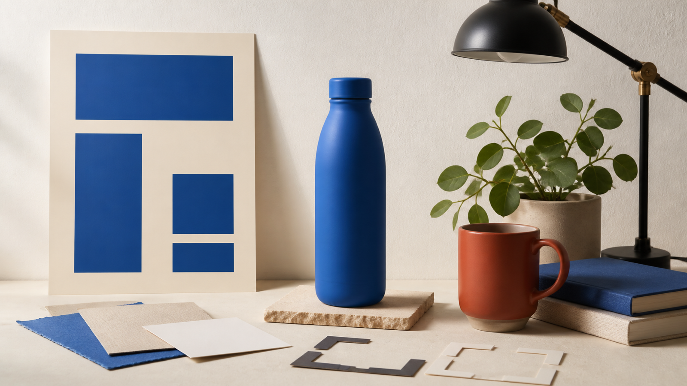
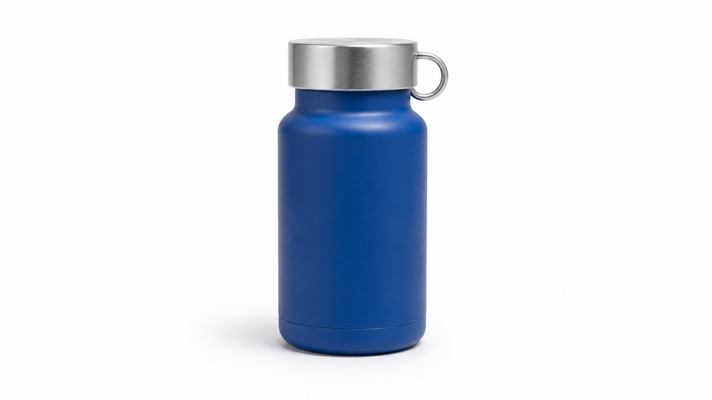

# 7 GPT Image 2 Prompts for Posters, Product Photos, and Text Layouts

**Published article:** [Read the formatted version on PromptZone](https://promptzone.com/heydreamai/7-gpt-image-2-prompts-for-posters-product-photos-and-text-layouts-5hi9)

> **Disclosure:** This article was prepared for HeyDream. The prompts are original methodology templates, not claims about a tested HeyDream output. Model capabilities mentioned below rely on cited OpenAI documentation.

Useful GPT Image 2 prompts define a visual job instead of piling style words onto a subject. These seven examples cover poster typography, product photography, controlled edits, and one deliberately crowded stress test. Each is a reusable starting point, not a guarantee of identical output.

This is a prompt-template guide. Images labeled as reference inputs are not verified GPT Image 2 outputs or HeyDream test results.



*AI-generated editorial illustration of the prompt categories in this guide; it does not depict model results or a product interface.*

## A Reusable Structure for GPT Image 2 Prompts

OpenAI's [GPT Image prompting guide](https://developers.openai.com/cookbook/examples/multimodal/image-gen-models-prompting-guide) recommends a clear structure. A practical order is:

1. Intended use
2. Scene or background
3. Main subject
4. Composition
5. Materials and lighting
6. Exact on-image text
7. Constraints

For editing, split the last step into what must change and what must remain unchanged. OpenAI's [GPT Image 2 model page](https://developers.openai.com/api/docs/models/gpt-image-2) documents generation and editing support, although controls can differ by interface.

## GPT Image 2 Prompts for Posters and Text Layouts

### 1. Minimal Poster With One Short Headline

Limit the copy to two strings and remove opportunities for invented details.

```text
Intended use: a vertical social media poster for a fictional design workshop.

Create a minimal editorial poster on a warm-white paper background. Place one oversized cobalt-blue sans-serif headline in the center and reproduce it exactly: “MAKE ROOM”. Under it, add one smaller charcoal-gray line exactly: “A DESIGN WORKSHOP”. Use a strict centered grid, generous negative space, crisp letter edges, and a subtle screen-printed texture. Do not add dates, logos, icons, signatures, watermarks, decorative letters, or any other words.
```

Before publishing, check for doubled letters, unwanted punctuation, and decorative marks that resemble text.

### 2. Event Poster With Controlled Information Hierarchy

The second prompt adds information while assigning each line a role. Together, these are GPT Image 2 text rendering prompts for short copy and hierarchy.

```text
Create a vertical poster for a fictional botanical exhibition. Use a deep forest-green background and one pale magnolia flower in the lower-right corner. Arrange this copy in a clear hierarchy and reproduce it exactly: title “NIGHT BLOOM”; date “SEPTEMBER 18”; venue “RIVER HALL”; callout “DOORS 7 PM”. Use a high-contrast serif for the title and a clean sans-serif for the remaining text. Do not invent sponsors, prices, URLs, logos, extra copy, signatures, or watermarks.
```

If the hierarchy collapses, shorten the supporting copy before adding style instructions. The four text blocks should remain visually distinct.

## GPT Image 2 Product Photography Prompts

### 3. White-Background Product Hero Shot

Product prompts need explicit geometry, material, camera angle, and exclusions.

```text
Create a photorealistic studio product photograph of one short cylindrical reusable bottle. Give it a matte cobalt-blue body and a brushed-silver screw cap with a small oval carry loop, with no logo or label. Use a three-quarter front view at eye level on a seamless pure-white background, soft diffused light from the upper left, accurate circular geometry, and a restrained contact shadow. Do not add text, hands, liquid, condensation, props, packaging, signatures, or watermarks.
```

Review the cap, bottle base, and shadow first. Small geometry errors matter more here than an elaborate background.

### 4. Lifestyle Product Shot With Copy Space

This version moves the bottle into a scene with one priority: usable empty space.

```text
Create a wide morning-kitchen banner featuring one short cylindrical reusable bottle with a matte cobalt-blue body and a brushed-silver loop cap. Place it upright in the right third on a light oak counter. Keep the left half quiet and uncluttered as copy space. Use soft window light, a neutral plaster wall, one folded beige cloth, and one small out-of-focus herb pot at the far right. Do not add text, labels, logos, hands, food, extra bottles, busy shelving, signatures, or watermarks.
```

Useful copy space must also be free of strong edges, props, and high-contrast shadows.

## GPT Image 2 Editing Prompts With Preserve Rules

The [OpenAI image generation guide](https://developers.openai.com/api/docs/guides/image-generation) distinguishes single-shot generation or editing from conversational workflows. In either format, name the target change and the invariants separately.

### 5. Replace One Object Without Redesigning the Scene

Use a project-owned reference image containing a red mug, two books, a plant, and a lamp.


*Source input for Prompt 5. No edited result is shown; this AI-generated image is not a HeyDream test result.*

```text
Edit the supplied image. Replace only the red ceramic mug with a clear ribbed drinking glass filled halfway with water. Preserve the camera angle, crop, tabletop, two books and their positions, plant, lamp, wall color, lighting direction, shadow softness, depth of field, and overall color balance. Keep the new glass in the mug's footprint at approximately the same height. Do not move, remove, redesign, or add any other object. Do not add text or branding.
```

Compare everything outside the edited region. A convincing glass is still a poor edit if the books, plant, crop, or lighting changed.



*Reference input for Prompt 6. This AI-generated image is not an evaluated GPT Image 2 or HeyDream output.*

### 6. Change the Background While Preserving the Subject

Here, only the background may change.

```text
Edit the supplied product image. Keep the bottle unchanged and replace only its surroundings with a quiet sunlit stone windowsill in a modern studio. Preserve the bottle's body shape, cobalt-blue color, brushed-silver cap, oval carry loop, proportions, orientation, edge detail, scale, and lack of branding. Keep the camera angle unchanged. Match the new background to soft left-side morning light and add only the natural contact shadow required by the new surface. Do not redesign, label, duplicate, or crop the bottle.
```

Inspect the cap and carry loop first; small features reveal whether the subject was preserved or redesigned.

## A Dense-Text Stress Test and One Controlled Revision

### 7. Reduce Copy Density Without Changing the Scene

The original prompt intentionally combines five objects with six text blocks. It is a diagnostic, not a recommended layout.

```text
Create a wide makers-market graphic on a midnight-blue background. Arrange a coral vase, mustard tote bag, silver desk lamp, green notebook, and clear glass on two cream plinths. Reproduce this copy exactly: “CITY MAKERS MARKET”; “CERAMICS · PRINTS · OBJECTS”; “SATURDAY + SUNDAY”; “10 AM—6 PM”; “HARBOR STUDIO 4”; “FREE ENTRY”. Use a bold geometric title, smaller supporting text, coral and cream accents, and generous margins. Do not add brands, sponsors, URLs, prices, objects, words, signatures, or watermarks.
```

For the controlled revision, change only the copy density:

```text
Keep the same scene, five objects, two plinths, palette, composition, and lighting. Include only this exact copy: “CITY MAKERS MARKET”; “WEEKEND · 10 AM—6 PM”; “FREE ENTRY”. Do not add any other words or objects.
```

If you run both prompts, compare the resulting outputs under the same interface, settings, and input conditions. Any improvement supports a narrow lesson about that run, not a universal benchmark.

## Frequently Asked Questions

### How long should a GPT Image 2 prompt be?

Long enough to state the visual job, composition, important details, and constraints. Remove repetition that does not change the image.

### How can I improve text inside a generated image?

Use short verbatim copy, define hierarchy, limit competing elements, and verify every character. For dense layouts, set long-form typography separately.

### What should an editing prompt preserve?

Name the required invariants: identity, geometry, labels, crop, camera angle, lighting, surrounding objects, or color balance. Do not rely on “keep everything else the same.”

### Will these prompts always produce the same result?

No. Results may vary by interface, model version, settings, input image, and run. Save the exact prompt and conditions when reproducibility matters.

## Conclusion

The most useful GPT Image 2 prompts turn an aesthetic idea into a defined visual task. Start with intended use, composition, exact copy, and constraints; for edits, separate the change from the preserve list. You can adapt one of these patterns in the [HeyDream image generator and editor labeled “Free GPT Image 2”](https://heydream.im/free-gpt-image-2/), but verify the current free allowance and each result, then record the page label, settings, date, prompt, and input, if any, before treating the run as evidence.
